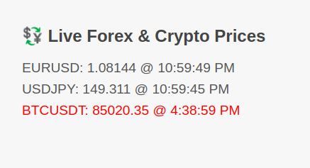

# Backend — Real-Time Financial Price Feed Service

This is a containerized .NET 7 backend service that provides real-time financial instrument prices
(via REST API and WebSocket), using Binance and Tiingo as data providers. It includes a complete 
Docker-based test setup and supports over 1,000 concurrent WebSocket subscribers using SignalR.

---

## Purpose of this project

The goal of this project is to provide a robust, scalable, real-time price feed service for both 
cryptocurrency and forex markets. This backend can serve trading apps, dashboards, and analytics 
platforms that need access to up-to-date financial pricing data.

---

## ⚙️ Tech Stack

- **.NET 7 (ASP.NET Core Web API)**
- **SignalR** for WebSocket broadcasts
- **Binance WebSocket API** for BTCUSDT
- **Tiingo WebSocket API** for EURUSD and USDJPY
- **xUnit** + **Moq** for unit testing
- **Docker & Docker Compose**

---

## REST API Endpoints

| Method | Endpoint                              | Description                                 |
|--------|----------------------------------------|---------------------------------------------|
| GET    | `/api/instruments`                    | Returns a list of available instruments     |
| GET    | `/api/instruments/{symbol}`           | Returns the current price of the instrument |

---

## WebSocket Endpoint

SignalR-based WebSocket for real-time price updates:

```
ws://localhost:5000/ws/prices
```

Subscribe to an instrument using:
```js
connection.invoke("Subscribe", "BTCUSDT")
```

---

## 🐳 How to Run with Docker

### Run backend + frontend:

```bash
docker compose up --build
```

> Be sure to define your API key in a `.env` file.

```
TIINGO_API_KEY=your_real_tiingo_token_here
```

---

### Run Tests (via Dockerfile.test)

```bash
docker compose --profile test up --build
```

This runs all unit tests inside the container using the `backend.Tests/Dockerfile.test`.

---

## Test Coverage

- `PriceServiceTests` — Tests price caching and lookup
- `InstrumentsControllerTests` — Tests API routes for price and list fetching

---

## Frontend (Basic Client)

A simple `index.html` is located in the `./frontend` directory. It connects to the WebSocket service 
and displays real-time price updates for subscribed instruments.



To access the frontend after running Docker:

```
http://localhost:8080/
```